# DOM terminology Playwright basic
## Functions advance
### Function expression
- Định nghĩa function bằng cách gán nó cho một biến 
#### Function Declaration (khai báo hàm) 
    function add(a, b) {
    return a + b;
    }
#### Function Expression (biểu thức hàm)
    const add = function(a, b) {
    return a + b;
    };
#### So sánh cách gọi
    console.log(add(2, 3)); 
- => Output:// 5 - cả hai đều giống nhau
### Lambda function (Arrow Function)
- Lambda function (còn gọi là Arrow Function)
- Xuất hiện lần đầu trong ES6 (ES2015).
- Đây là cách viết ngắn gọn hơn cho function
- Sử dụng dấu =>
#### Function truyền thống
    function add(a, b) {
    return a + b;
    }

#### Function expression
    const add = function(a, b) {
    return a + b;
    };

#### Arrow function (Lambda)
    const add = (a, b) => {
    return a + b;
    };
- Lambda function: một số cách viết khác
    - Nếu chỉ có 1 dòng code => có thể “rút gọn” cặp ngoặc nhọn
#### Cú pháp ngắn gọn nhất (implicit return)
    const add = (a, b) => a + b;

#### Không có tham số
- Phải có dấu ngoặc tròn rỗng
    >const greet = () => console.log("Hello!");
    const getRandom = () => Math.random();

#### Một tham số
-  Có thể bỏ dấu ngoặc tròn
    >const double = x => x * 2;
    const square = x => x * x;
-  Hoặc giữ dấu ngoặc (tùy style)
    >const triple = (x) => x * 3;
### Anonymous function
- Anonymous function (hàm ẩn danh):
    - function không có tên.
    - được sử dụng khi function chỉ cần dùng một lần hoặc làm callback.
#### Named function (có tên)
    function namedFunction() {
    console.log("I have a name!");
    }
#### Anonymous function (không tên)
    function() { // SyntaxError! Không thể đứng một mình
    console.log("I'm anonymous!");
    }
#### Anonymous function phải được sử dụng ngay
##### 1. Gán cho biến
    const anonymousFunc = function() {
    console.log("I'm anonymous but stored in a variable!");
    };
##### 2. Dùng làm callback
    setTimeout(function() {
    console.log("Anonymous callback!");
    }, 1000);
## DOM
- Khi vào một website, ta nhìn thấy website dưới dạng:
    - Các khối text
    - Các hình ảnh
    - Các liên kết
    - Các ô input
- Máy tính sẽ “nhìn” ở dưới dạng “cây có cấu trúc”
    - Mở cây này bằng cách bấm phím F12 (hoặc chuột phải vào vùng trống, chọn “Inspect”); sau đó chọn tab “Element”
    - Cấu trúc này gọi là DOM (Document Object Model)
    - DOM = Document Object Model
    - Node
        - `<option>United States</option>`
    - Một element
        - `<option>United States</option>`
    - Thẻ mở
       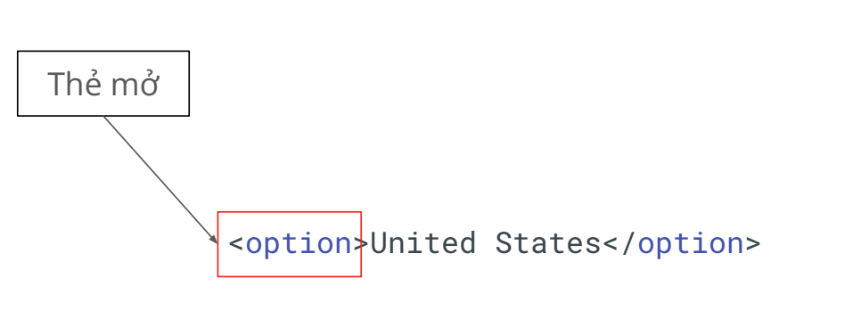
    - Thẻ đóng:
        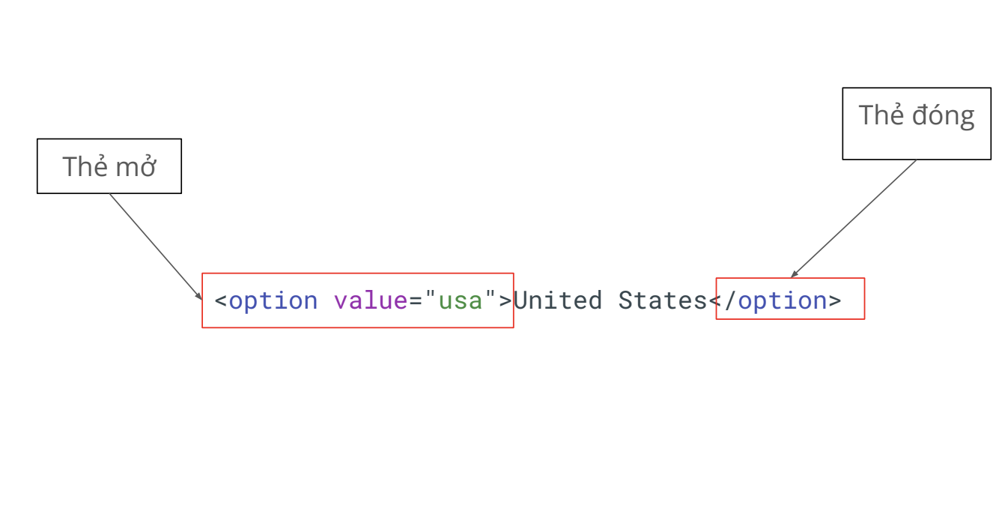
    - Thẻ tự đóng:
        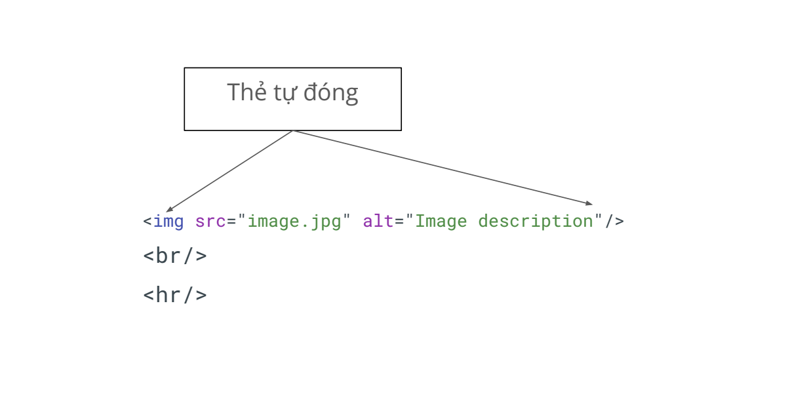
        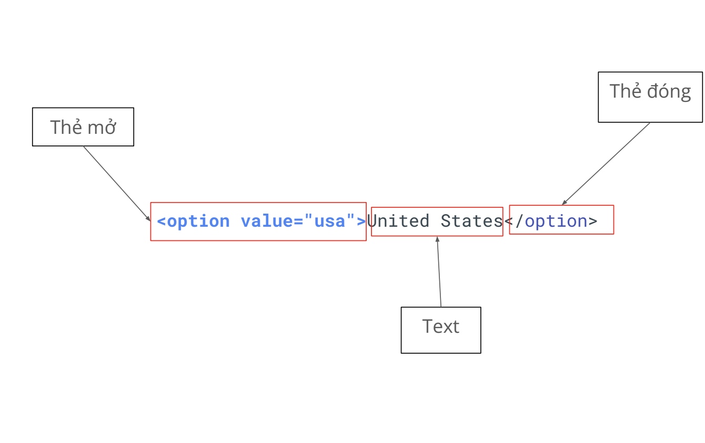
        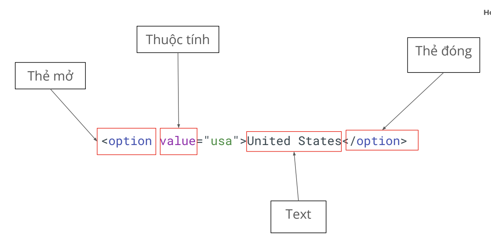

`<option value="usa" school=”HN”>United States</option>`

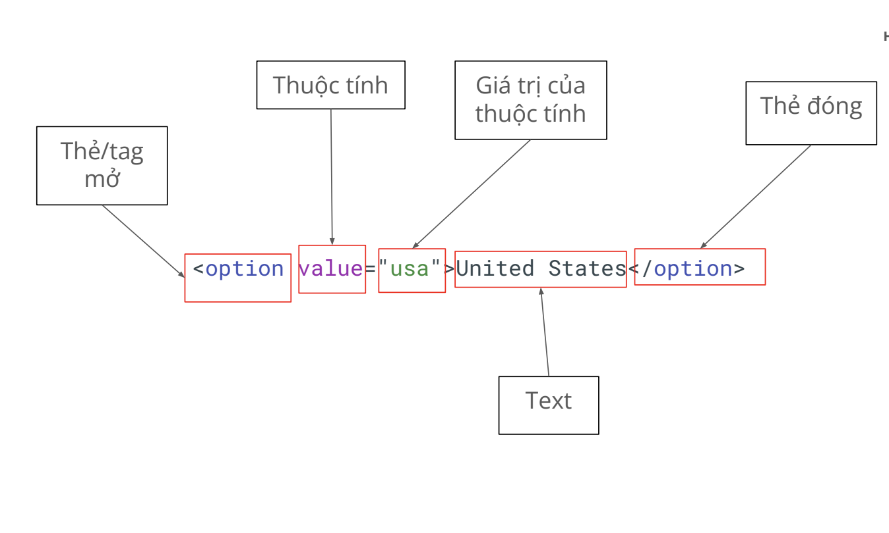

### Các thẻ HTML thường gặp
- Trên thực tế, có rất nhiều loại thẻ khác nhau:
    - Thẻ tiêu chuẩn: thẻ do tổ chức uy tín mozilla định nghĩa
    - Thẻ tự định nghĩa: do lập trình viên/ website tự định nghĩa
- Thẻ Cấu Trúc Cơ Bản
    - `<html>`: Thẻ gốc của trang
    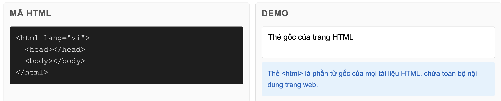
    - `<head>`: Chứa metadata: tiêu đề website, hiển thị Google
    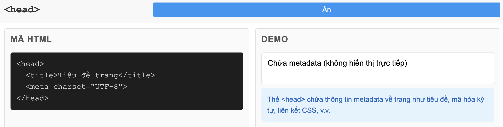
    - `<body>`: Nội dung của cả website hiển thị
    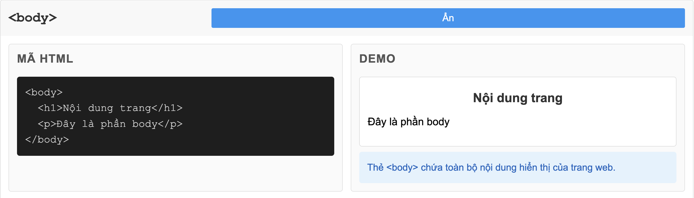   
    - `
`: Khối/container chung
    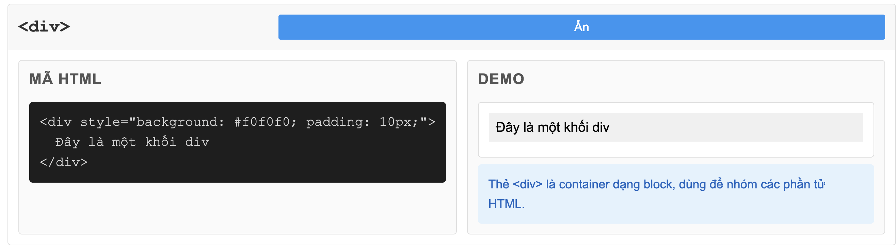 
    - ``: Inline container
    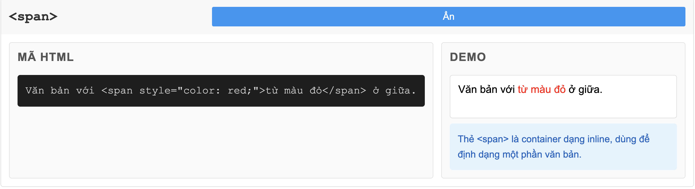 
    - `<header>, <footer>, <nav>, <section>`: Thẻ ngữ nghĩa
     
- Thẻ nội dung:
    - `<h1> đến <h6>`: Tiêu đề
     
    - `
`: Đoạn văn
    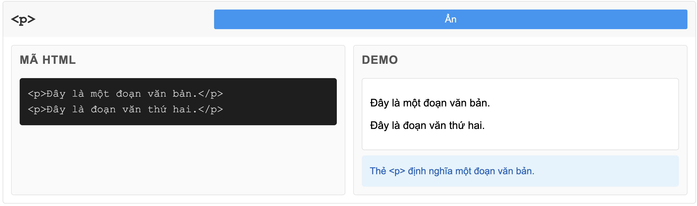 
    - `<a>`: Liên kết
    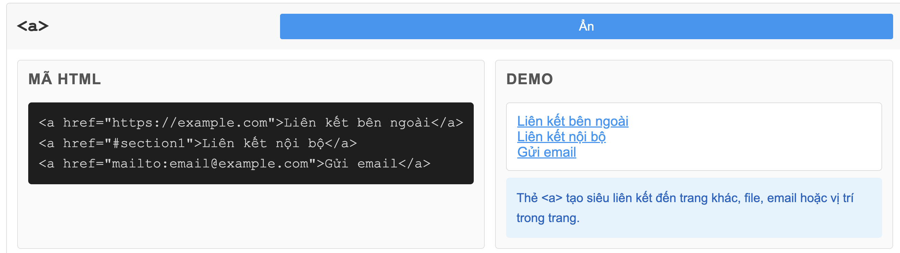 
    - ``: Hình ảnh
    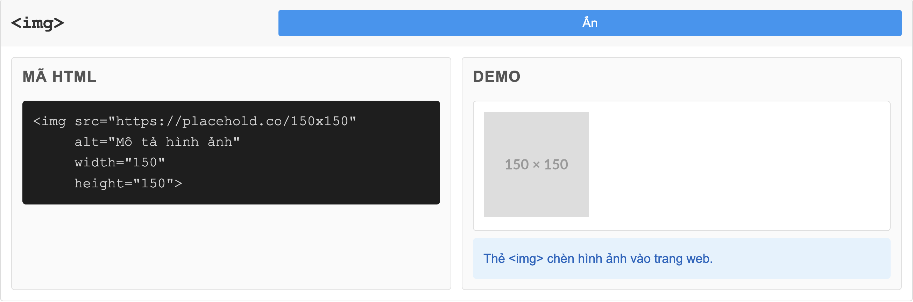 
    - `<ul>, <ol>, <li>`: Danh sách
     
    - `<table>, <thead>, <tbody>, <tr>, <th>, <td>`: table
     
- Thẻ Form (Quan trọng cho Testing):
    - `<form>`: Biểu mẫu
    - `<input>`: Ô nhập liệu (text, password, checkbox, radio, etc.)
    <!-- Text -->
    <input type="text" placeholder="Nhập văn bản">
    <!-- Password -->
    <input type="password" placeholder="Mật khẩu">
    <!-- Email -->
    <input type="email" placeholder="email@example.com">
    <!-- Number -->
    <input type="number" min="0" max="100">
    <!-- Tel -->
    <input type="tel" placeholder="0901234567">
    <!-- URL -->
    <input type="url" placeholder="https://example.com">
    <!-- Search -->
    <input type="search" placeholder="Tìm kiếm...">
    <!-- Date -->
    <input type="date">
    <!-- Time -->
    <input type="time">
    <!-- Datetime-local -->
    <input type="datetime-local">
    <!-- Month -->
    <input type="month">
    <!-- Week -->
    <input type="week">
    <!-- Radio -->
    <input type="radio" name="gender" value="male"> Nam
    <input type="radio" name="gender" value="female"> Nữ
    <!-- Checkbox -->
    <input type="checkbox" value="option1"> Tùy chọn 1
    <input type="checkbox" value="option2"> Tùy chọn 2
    <!-- Range -->
    <input type="range" min="0" max="100">
    <!-- Color -->
    <input type="color">
    <!-- File -->
    <input type="file">
    <!-- Hidden -->
    <input type="hidden" name="id" value="123">
    <!-- Submit -->
    <input type="submit" value="Gửi">
    <!-- Reset -->
    <input type="reset" value="Đặt lại">

    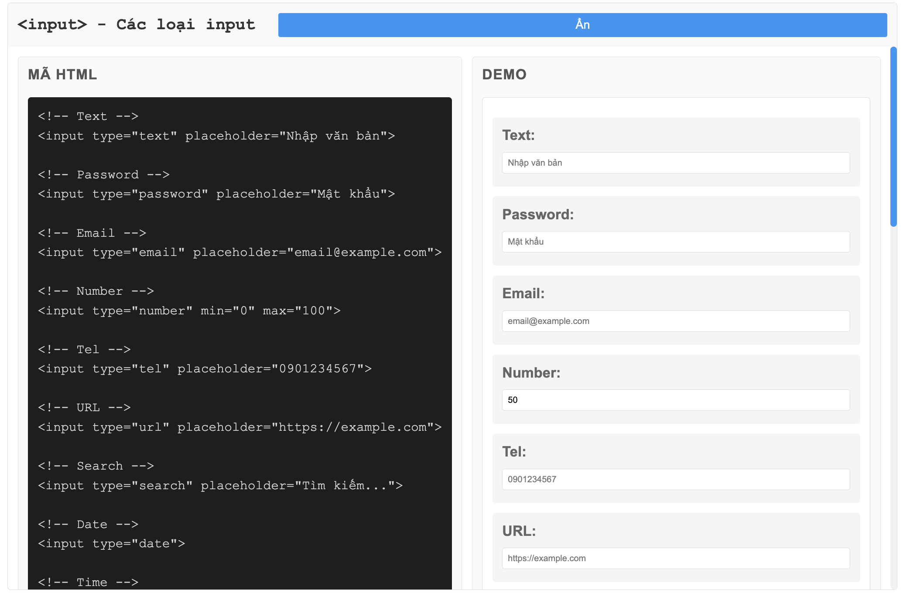     
    - `<button>`: Nút bấm
    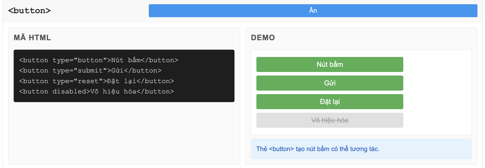   
    - `<select> và <option>`: Dropdown
     
    - `<textarea>`: Vùng văn bản nhiều dòng
    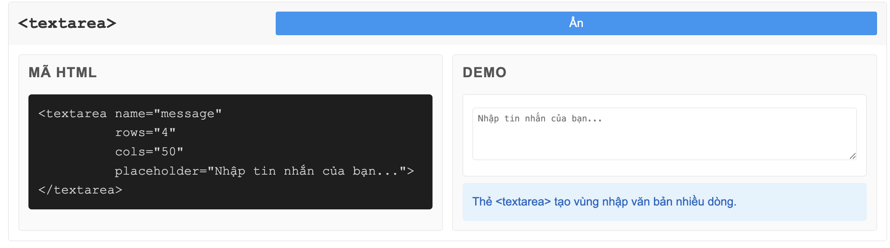 

## Selector
### Hiểu hơn về selector
- Automation = tương tác với các phần tử trên trang web
    - Input
    - Fill
    - Click
    - ...
- Để tương tác được, ta cần tìm được phần tử này
- Selector là công cụ giúp ta tìm
### Type selector
- Có 3 loại selector thường dùng:
    - XPath
    - CSS selector
    - Playwright selector
#### XPath
    - Dùng được trong hầu hết các trường hợp (99.99%)
    - Đa dạng, có khả năng tìm các phần tử khó
    - Hơi dài
    - VD: //button[normalize-space() = ‘Add to cart’]
    - CSS selector
    - Playwright selector
#### CSS selector
    - Ngắn gọn, performance cao
    - Dùng cho các trường hợp dễ tìm.
    - Không linh hoạt bằng XPath
    - VD: .add-to-cart
#### Playwright selector
    - Chỉ dùng riêng cho Playwright
    - Cú pháp ngắn gọn, không phụ thuộc vào cấu trúc DOM
    - Hướng tới “giống người dùng đang nhìn thấy gì”
    - VD: page.getByText(“Add to cart”);
### Khi nào thì dùng gì?
- Playwright selector > CSS Selector > XPath
- Vẫn cần học hiểu cả ba loại để có thể “cân” được mọi loại dự án.
- Có những dự án “thích” dùng CSS, “thích” dùng XPath, ta buộc phải tuân theo.
### XPath selector
- XPath = XML Path
- Có 2 loại:
    - Tuyệt đối: đi dọc theo cây DOM bắt đầu bởi 1 /
    - Tương đối: tìm dựa vào đặc tính bắt đầu bởi 2 //
        - VD: //tenthe[@thuoctinh=”giatri”]
- Nên dùng XPath tương đối
## Playwright basic syntax - Các cú pháp cơ bản
- Automation = tương tác + verify
- Trong bài này, ta học cách tương tác với các phần tử
    - Viết một test
    - Tổ chức thành các step
    - Tương tác cơ bản
    - Navigation
    - Click
    - Fill
### Test
- test: Đơn vị cơ bản để khai báo một test
- Câu lệnh:
    >import { test } from '@playwright/test';
    
    >test('<tên test>', async ({ page }) => {
    // Code của test
    });
### step
- step: Đơn vị nhỏ hơn test, để khai báo từng step của test case
- Câu lệnh:
    >await test.step('Tên step', async () => {
    // Code here
    });

    ------

    >test('<tên test>', async ({ page }) => {
    
    >await test.step('Tên step', async () => {
    // Code here
    });
    });

- Lưu ý: step nên được map 1-1 với test case để dễ dàng maintain.
### navigation
- >await page.goto('https://pw-practice.playwrightvn.c
om/');
### Locate
- Sử dụng page.locator(“<selector>”) để chọn phần tử trên trang
- VD: page.locator(“//input[@id=’email’]”)

### Click
- Single click
>await page.locator("//button").click();
- Double click
>await page.locator("//button").dblclick();

- Click chuột phải
>page.locator("//button").click({
button: 'right'
})
- Click chuột kèm bấm phím khác
> page.locator("").click({
modifiers: ['Shift'],
})
### Input
#### Fill
- Giống việc bạn paste content vào một ô input
>page.locator("//input").fill('Playwright Viet Nam');

#### pressSequentially
- Giống việc bạn gõ từng chữ cái vào ô input
>page.locator("//input").pressSequentially('Playwright Viet Nam', {
delay: 100,
});
### Radio/checkbox
- Lấy giá trị hiện tại đang là check hay không:
>const isChecked = page.locator("//input").isChecked();
- Check/ uncheck
>page.locator("//input").check(); page.locator("//input").setChecked(false);
### Select
>await page.locator('//select[@id=”country”]').selectOption({ label: 'USA' })
### Upload file
>await page.locator("//input[@id='profile']").setInputFiles("<file-path>");